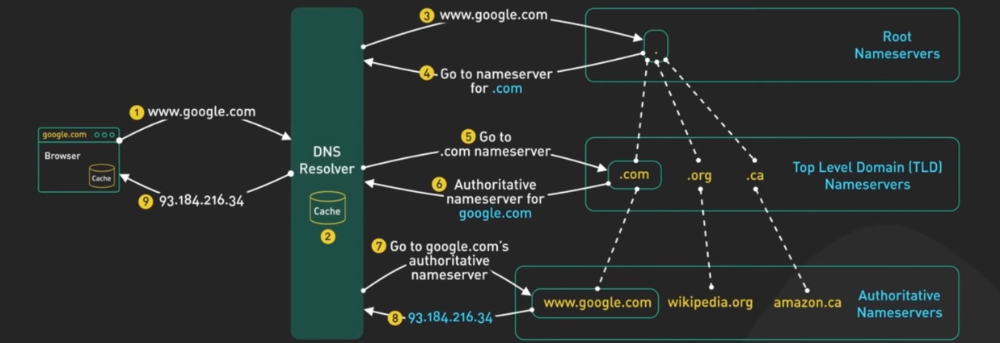

| Day | Topics |
|----------|----------|
| [Day 1](#day1---introduction-to-high-level-design-hld)    | What is HLD? <br> Delicious - Steps to make website live <br> Problems(&solutions) with ICANN <br> How DNS works? <br> Scaling Types (Vertical, Horizontal) <br> Gateway x Loadbalancer |
| [Day 2](#day2---load-balancer-configuration)    | Stateless & Statefull Loadbalancing <br> Consistent Hashing (v1 & v2) |
| [Day 3](#day3)    | Decoupling Compute & Storage layer <br> Caching & Types of Caching <br> Client-Side Caching <br> CDNs <br> CDN routing strategies|


# Day1 - Introduction to High-Level Design (HLD)

## 📘 What is HLD?

- HLD focuses on **designing scalable and distributed systems**.
- Unlike DSA (Coding + Problem Solving) and LLD (Writing good structured, reusable, extensible code), HLD is about:
    - Structuring servers and components
    - Supporting millions of users
    - Making system scale horizontally

> ❗ Designing for 1,000 users is different from designing for 1M or 100M users.

---

## 🎯 Learning Goals

- Understand fundamental system design concepts.
- Solve 7–8 common case studies (e.g., URL Shortener, Social Media, etc.)
- Motivation: Be confident about system design, not threatened by LLMs like ChatGPT.

---

## 🧠 Real-World Example: **Delicious (2004)**

- Problem: Bookmarks lost when changing browsers/machines.
- Solution: Centralized bookmarking tool — Login and save bookmarks accessible from any device.
- Architecture:
    - Client: Any browser
    - Server: A single desktop acting as server

---

## ✅ Steps to Make Website Live

### Step 1: Buy Static Public IP

- **Public IP**: Accessible from the Internet
- **Private IP**: Only accessible within intranet
- **Static IP**: Fixed IP for servers (expensive, assigned by ISP)
- **Dynamic IP**: Temporary IP (cheap, suitable for clients)

> ISPs use **NAT (Network Address Translation)** to manage IP allocation

---

### Step 2: Buy Domain Name

- Domain purchased from registrars like GoDaddy.
- Browsers access websites using **IP addresses**, not domain names.

---

### Step 3: Map Domain to IP

- **ICANN**: Non-profit managing domain names and TLDs (.com, .org, etc.)
- Mapping process:
    - Registrar sends domain ownership to ICANN.
    - Owner sends IP address to registrar.
    - Registrar updates ICANN with IP mapping.
    - Now browsers can resolve domain → IP.

---

## ❌ Problems with ICANN

### 1. Latency
- ICANN servers are in Europe → Higher latency for other regions (e.g., India).

### 2. Traffic Bottleneck
- Every domain resolution request hits ICANN → High traffic load.

### 3. Single Point of Failure (SPOF)
- ICANN downtime = Internet-wide DNS failures.

---

## ✅ Solutions to ICANN Issues

### Key Concepts

- **Sharding**: Split domain responsibilities by TLD.
- **Replication**: Multiple copies of TLD servers to avoid SPOF.
- **Caching**: Store frequently used domain-IP mappings closer to users.

### DNS Caching Strategy

- Cache only frequently accessed domains in each region.
- First-time domain lookup → Slower.
- Cached domain → Faster access.

#### Neighborhood DNS

- Maintained by ISPs (e.g., Airtel, Jio)
- Also by companies like Google, Facebook to improve access speed.

---

## 🌍 DNS Hierarchical System

- **TLD Servers**: Managed and replicated by ICANN
- **Geographical Caches**: Maintained by ISPs, Google, etc.
    - Continent → Country → City → Neighborhood
- Use **MFU (Most Frequently Used)** cache replacement policy.

---

## 🔁 Recursive DNS Lookup

1. Check Browser Cache
2. Check OS Cache
3. Check Neighborhood DNS
4. Check ISP/Root DNS
5. ICANN TLD → Authoritative DNS

> DNS caches attach a **TTL** (Time-To-Live). After expiry, new mapping is fetched.

---

## 🌐 How Internet Works (Flow)

1. User types `www.delicio.us` in browser.
2. Recursive DNS lookup fetches IP.
3. Browser connects to IP.
4. Server responds.

---

## 🧩 DNS Server Types

- **Recursive DNS (Resolver)**:
    - First server to receive query from user.
    - Checks cache or queries others to resolve domain name.

- **Root DNS Servers**:
    - Provide list of TLD servers (.com, .org, etc.)

- **TLD DNS Servers**:
    - Direct to authoritative servers for specific domain extensions.

- **Authoritative DNS Servers**:
    - Final source of truth. Holds actual domain-IP records.

---

## 🌐 DNS Resolution Example (`https://xyz.com`)

1. Browser → Recursive DNS (via ISP)
2. If not in cache → Request sent to Root DNS
3. Root DNS → Returns TLD (.com) server
4. TLD Server → Returns Authoritative server for xyz.com
5. Authoritative DNS → Returns IP address
6. Resolver caches & returns IP → Browser connects

---
---

# APIs and Scaling Challenges – delicio.us

## 🧩 Exposed APIs

### Authentication
```java
authenticate(user_id, password, meta_data)
// Returns access token (e.g., JWT)
```

### Bookmark Operations
```java
createBookmark(access_token, name, url, timestamp)
getBookmarks(access_token, noOfBookmarks, offset)
```

---

## 💥 Challenges with Desktop-based Setup

### Limitations at Scale
- Works well for a few hundred/thousand users.
- Fails at scale (1M–100M users), especially with concurrency.

### Issues
- **Single Point of Failure**: If desktop crashes or restarts, service goes down.
- **Resource Bottlenecks**:
  - Compute
  - Memory
  - Disk
  - Network bandwidth

---

## 🛠️ Solutions

### ✅ Addressing Failures and Bottlenecks

| Problem                 | Solution       |
|------------------------|----------------|
| Single Point of Failure | **Replication** |
| Resource Bottleneck     | **Sharding**    |

#### Types of Sharding
- **CPU / RAM Bottleneck** → Horizontal scaling of App Servers
- **Disk Bottleneck** → Horizontal scaling of Database Servers

---

## 🧱 Scaling Types

### 🔼 Vertical Scaling
- **Definition**: Upgrade to a more powerful machine.
- **Cluster**: A group of servers running the same code.

#### 🔻 Drawbacks
- Doesn't eliminate single point of failure.
- Expensive (due to high-end hardware and R&D).
- Hard to estimate future capacity.
- No elasticity for fluctuating traffic (e.g., during festivals).

---

### ➕ Horizontal Scaling (Distributed Computing)
- **Definition**: Add more machines instead of upgrading one.
- **Works by**: Running multiple low-cost servers in parallel.

#### ✅ Advantages
- No single point of failure.
- Cost-effective (uses commodity hardware).
- Easier to scale incrementally.
- Elastic: Can scale up/down based on traffic.

#### 🔻 Disadvantages
- Requires **code restructuring**.
- Need to implement:
  - Load balancing logic
  - Data distribution logic
  - Inter-service communication
- **Consistency issues** arise (multiple data sources).
- More architectural complexity.

---

### 🔍 Note
> In CAP Theorem, Vertical Scaling aligns more with **CA (Consistency + Availability)** model.

---


# Gateway / Reverse Proxy

**Gateway** is the server/machine that faces the **intranet** on one side and the **Internet** on the other side.

Gateway is also called a **reverse proxy**.

---

## Role of Gateway

- Gateway is the **entry point** for any client/browser to connect to servers within the cluster.
- The client/browser needs to know only the **Gateway’s IP address**, not all internal servers.
- One interface of the Gateway has a **Public IP Address** and the other has a **Private IP Address**.
- **Servers** in the cluster have **Private IPs** — external clients never contact them directly.

---

## Is Gateway a Single Point of Failure (SPOF)?

Not necessarily — mitigation strategies:

- Gateways do **not hold business logic**, they just forward traffic → **lightweight**.
- Gateways follow:
  - **Active-Passive** setup (Passive takes over when Active fails)
  - **Active-Active** setup
- Gateways use **Virtual IP Address (VIP)**:
  - GW1 and GW2 have different physical IPs but share the same VIP.
  - Clients connect using the **VIP**.

---

# Gateway vs Load Balancers

- Gateway and Load Balancer are **different components**:

| Gateway                     | Load Balancer                     |
|----------------------------|------------------------------------|
| Entry point to the cluster | Distributes load among servers     |
| Faces the public internet  | Resides inside internal network    |
| Performs security checks   | Uses algorithms to route traffic   |

- Sometimes both are **combined in the same hardware**.

---

## Gateway & Load Balancer Setup

- **Gateway**: Positioned at the network edge, connects internal network to internet.
- **Load Balancer**: Distributes requests within internal network.

### Flow of Traffic

```
Internet User
     |
     v
-----------------------
  Internet Gateway
  (Public IP Address)
-----------------------
     |
     v
-----------------------
    Load Balancer
-----------------------
     |
     v
---------------------------------
|         |          |          |
App1    App2      App3
---------------------------------
```

---

# Combined Gateway + Load Balancer Setup

- A single **combined machine/service** can handle:
  - Gateway functions (security, entry point)
  - Load Balancing (distribution logic)

### Pros

- **Simple** and easier to manage (good for small deployments)
- Fewer machines required

### Cons

- Can become a **Single Point of Failure**
- Might not scale well for **high-traffic** apps

### Flow of Traffic

```
Internet User
     |
     v
-------------------------------------
| Combined Gateway/Load Balancer   |
|   (Public IP Address)            |
-------------------------------------
     |
     v
---------------------------------
|        |         |         |
App1    App2     App3
---------------------------------
```

---

# Load Balancer

- **Load Balancer (LB)** distributes the load to servers in a cluster.
- Uses algorithms like:
  - Round Robin
  - Least Connections
  - IP Hash


---


# Day2 - Load Balancer Configuration

## Two kinds of LB configuration
- **Stateless Load Balancing**
- **Stateful Load Balancing**

---

## Stateless Load Balancing

In a stateless system, all the machines are equally well equipped to respond to any query. Requests can be forwarded to any server randomly.

- No stickiness: A request from the same user can go to different servers.
- Algorithms are simple and straightforward.

### Algorithms used in Stateless LB

#### 1. Round Robin
- Cycles through servers from 1 to N.
- Equal distribution of load.

#### 2. Least Response Time First
- Prioritizes servers that respond faster.
- Suitable when server configurations vary.

### When It’s Used:
- **Token-Based Authentication** (e.g., JWT)
- **Microservices / RESTful APIs**

#### Examples:
1. Calculator website.
2. Website where a shared DB is used by stateless app servers.

---

## Stateful Load Balancing

Each session is tied to a specific server for its lifetime.

- Stickiness is required.
- Server must maintain session context.

### When It’s Used:
- **Session-Based Authentication**
- **Sticky Sessions (Session Affinity)**

#### Examples:
1. Websites using session-based auth (e.g., PHP, Java EE).
2. LLM chat systems like ChatGPT.
3. City-specific weather data.

### Algorithms / Strategies

#### 1. HashMap-based Routing
- `Map<user_id, server_id>`
- Simple to implement.
- Large memory footprint.
- Requires stopping system when adding servers.

#### 2. Modulo-based Routing
- `user_id % number_of_servers`
- Lightweight, no large memory.
- Poor scalability—reshuffles all data on change.

---

## Consistent Hashing (v1) – Stateful LB Algorithm

- Circle of numbers: 0 to 10^19.
- Machines and users are hashed and placed on the circle.

### Steps:

1. Use 2 hash functions:
   - `Hm(machine_id)` → server location
   - `Hu(user_id)` → user location
2. Create a sorted array mimicking the circle.
3. Binary search on user hash to find ceiling server hash.

### Benefits:
- Efficient (O(log N)), even with thousands of servers.
- No huge maps.
- More stable than modulo hashing.

### Problems in v1:

#### Adding a server
- Only relieves one next server of load.

#### Removing a server
- Can cause cascading failure due to load shift.

---

## Consistent Hashing (v2) – Enhanced

### Improvements:
- Multiple hash functions for each machine.
- Each machine is placed at multiple positions.

### Benefits:
- Load distributed among many servers.
- No single-point overload or cascading failures.
- Still O(log N) time.
- Minimal reassignments when adding/removing servers.

### Collision Handling:
- Very rare.
- Add salt to resolve if any.

### Summary:

- Efficient and scalable.
- Stateless LB: simple, good for token-based systems.
- Stateful LB: complex, good for session or data affinity.
- Choose algorithm based on use-case.

---


# Day3

## Decoupling the Compute and Storage Layer

### System Types

- **Computing Systems (Application Layer / Business Logic Server):**
  - Run business logic
  - Hardware: High CPU, High RAM, Low Disk

- **Storage Systems (Database Layer):**
  - Store persistent data
  - Hardware: Large Disk, Low CPU and RAM

### Why Decouple?

1. **Hardware Requirements Differ**
   - Compute: CPU/RAM focused
   - Storage: Disk-focused

2. **Scale Requirements Differ**
   - One storage machine can serve data to multiple compute servers

3. **Deployment Requirements Differ**
   - Frequent deployment on compute
   - Coupling leads to unnecessary storage downtime

### Architecture Before vs After Decoupling

- **Before**: Monolithic
- **After**: Compute and Storage communicate over network

**Request-Response Flow:**

Client → Gateway/LB → App Server → Storage → App Server → Gateway/LB → Client

**Downside:**  
- Extra network hop between Compute and Storage layers.

---

## Types of Time in a Request

- **Round Trip Time (RTT)**: Client ↔ Server
- **Compute Time**: Logic execution
- **Network Time**: Compute ↔ Storage
- **Database Time**: Query execution

> All these times add up for one user request.
> Real-world apps aim to make these negligible.

---

## Caching

### What is Caching?

> Storing a **copy** of **frequently used partial data** to **reduce latency**.

- **COPY**: Not source of truth
- **FREQUENTLY**: Often accessed data
- **PARTIAL**: Only required data
- **LATENCY**: Time to fetch

> **Best Example**: DNS caching (hierarchical)

---

## Types of Caching

### 1. Client-Side Caching

#### What?
Caching in the browser/app.

#### Use Cases:

- **Google Search Suggestion**
  - First call returns 100s of results.
  - Subsequent key strokes filtered from cache.
  
- **Instagram Feed**
  - App shows cached feed on start
  - Fetches fresh feed in background

- **Slack**
  - Profile images, names

- **Cookies**
  - Fall under client-side caching

- **DNS Caching**
  - Browser and OS level

#### Optimization:
- Send real requests only after certain characters
- Reduce server load

---

### 2. Content Delivery Networks (CDNs)

> **Goal**: Scale media transmission (images/videos)

#### Static Media:
- Profile pictures, post images
- Large size, low change frequency

#### Dynamic Content:
- HTML, CSS, JS
- Small, frequent changes

#### Problems:
1. Large size
2. Rarely updated
3. High load on central server

#### CDN Products:
- Akamai (OG)
- AWS CloudFront
- Azure FrontDoor
- Cloudflare CDN
- FBCDN (Facebook)

#### CDN Architecture:
- Central Server
- Edge Servers (closer to user)

#### Flow:
1. FB uploads media + hashcode
2. Sent to CDN central server
3. Replicated to edge servers
4. Users fetch from nearby edge

#### Example:
- FB URL: facebook.com/photo/?fbid=…
- CDN URL: scontent.fblr1-7.fna.fbcdn.net/…
- fblr = Bangalore CDN Edge Server

#### CDN Eviction:
- Remove old media if space is needed
- If missing, fetch again from FB and cache

#### Performance:
- First 5–10% of requests slower
- Next 90–95% are super fast

---

## CDN Routing Strategies

### Strategy A: **Location Based**
- FB maps user’s location to specific CDN URL

### Strategy B: **Rerouting**
- Client first hits central CDN
- Central redirects to nearby edge server

### Strategy C: **Anycast Routing**
- Client fires requests to all edge CDNs
- First responder is used for future requests

---

## Real-Life Example

**Hotstar 2011 Cricket Match:**
- Akamai CDN in India overloaded
- Indian users routed to Singapore CDNs

---